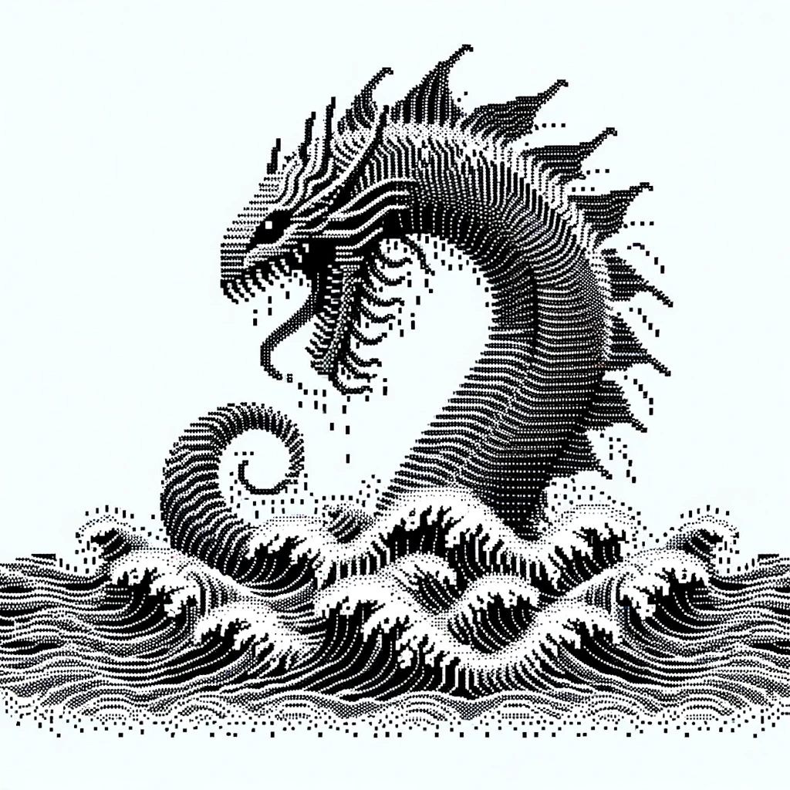

<h1 align="center">Hi there, I'm W4RSH3LL 🐚</h1>

  

<h3 align="center">A passionate Cybersecurity Enthusiast</h3>

---

### 🌱 About Me

I'm **W4RSH3LL**, deeply passionate about cybersecurity. I am always eager to learn new technologies and challenge myself in various ways. With a keen interest in understanding the nuts and bolts of security protocols and systems, I dedicate my time to exploring and securing digital environments.

### 💼 Tech Stack

Here are some of the technologies I work with:

### 🚀 Projects

- **Project 1**: A small combination of a Network Scanner script, ARP Spoofer script and a Packet Sniffer to place you in the middle of the connection and sniff credentials.
- **Project 2**: A python reconaissance script used to automate the different scans for HTB Machines: Nmap, Dirb, etc...

### 📫 How to Reach Me

Feel free to connect with me on [LinkedIn](https://www.linkedin.com/in/samuel-mc-calla-7026012ba/?originalSubdomain=fr) or send me an email at `s.mccalla@proton.me`.

